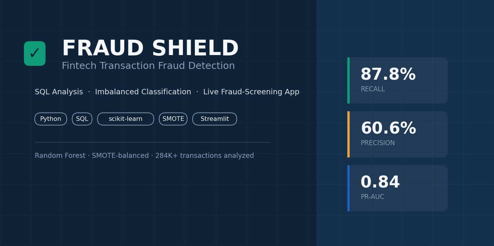
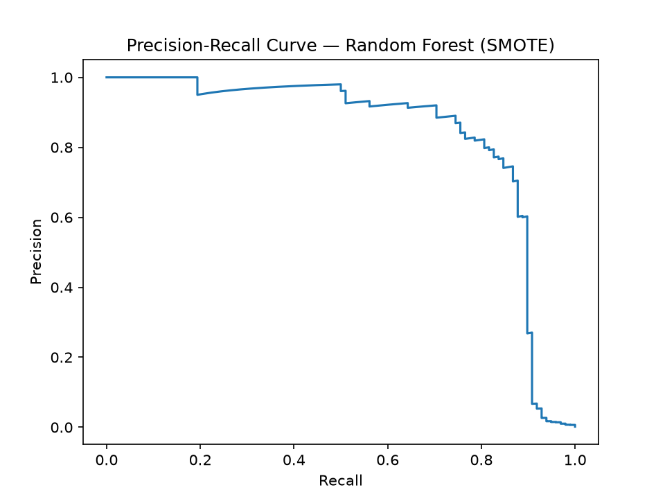
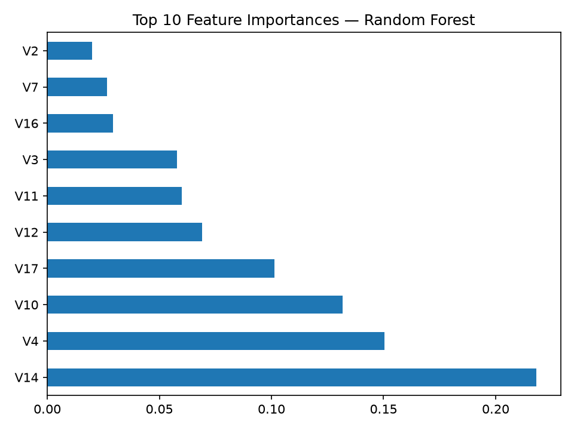
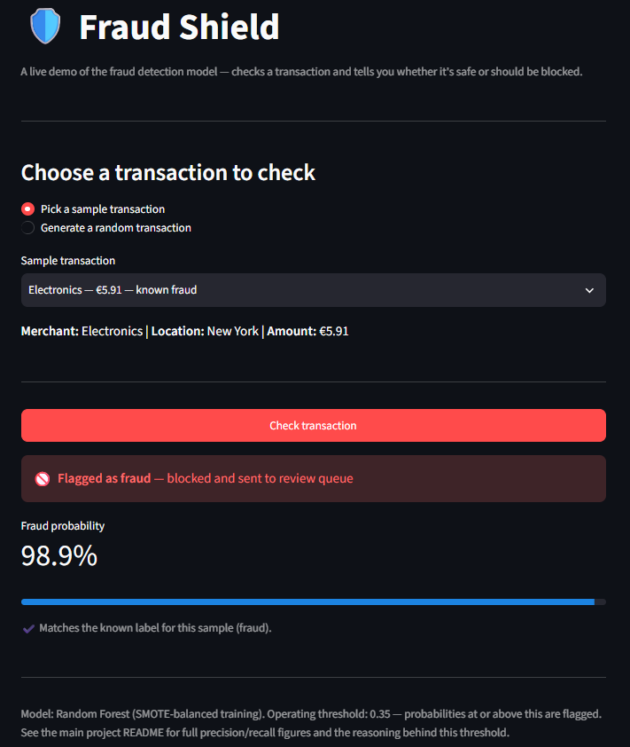
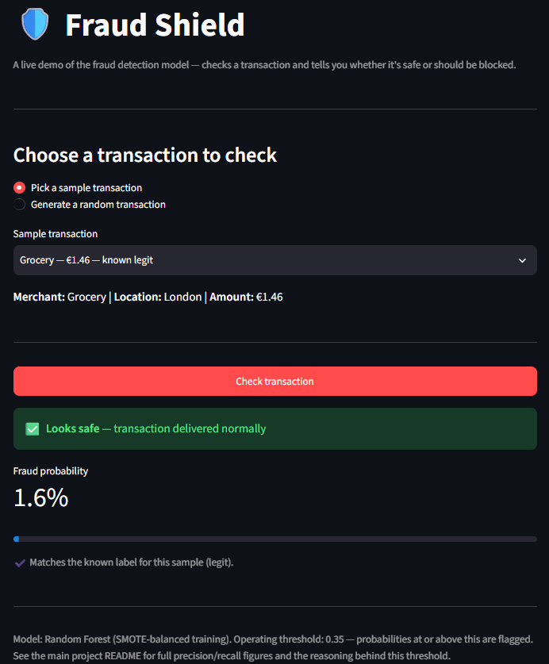
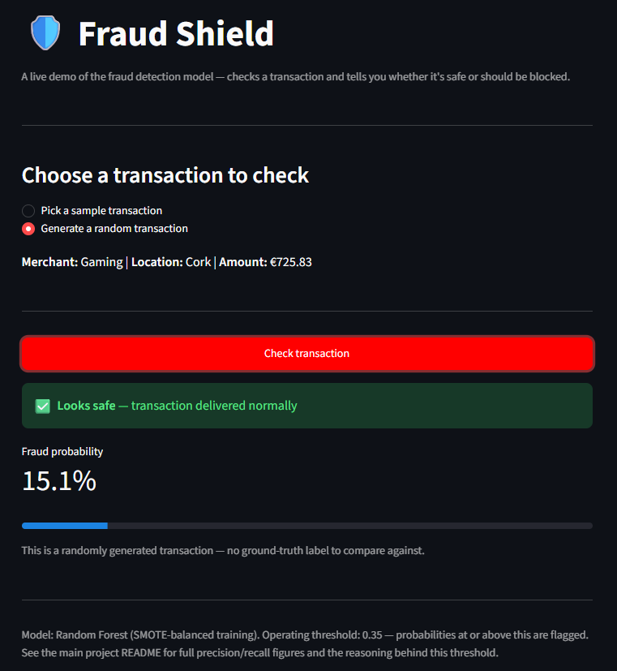

# 🛡️ Fintech Transaction Fraud Detection
## 🔍 Imbalanced Classification, SQL Analysis, and a Live Fraud-Screening App

<p align="center">
  
  
  
  
  
  
  
  
</p>

<div align="center">
  
</div>

## 📚 Table of Contents

- [📌 Introduction](#-introduction)
- [📌 What the Project Does](#-what-the-project-does)
- [🌟 Why the Project is Useful](#-why-the-project-is-useful)
- [🎯 Business Questions](#-business-questions)
- [🛠️ Tools and Technologies](#️-tools-and-technologies)
- [📂 Dataset](#-dataset)
  - [📥 Dataset Loading](#-dataset-loading)
  - [🔗 Dataset Source](#-dataset-source)
  - [📊 Dataset Structure](#-dataset-structure)
- [🧹 Data Preparation and Class Imbalance](#-data-preparation-and-class-imbalance)
- [🚀 How to Get Started](#-how-to-get-started)
- [🗄️ SQL Analysis](#️-sql-analysis)
  - [⏰ Fraud Rate by Hour, Merchant, and Location](#-fraud-rate-by-hour-merchant-and-location)
  - [📏 Statistical Outlier Detection](#-statistical-outlier-detection)
  - [📈 Rolling Fraud Rate](#-rolling-fraud-rate)
- [🤖 Model Training and Evaluation](#-model-training-and-evaluation)
  - [⚖️ Logistic Regression vs. Random Forest](#️-logistic-regression-vs-random-forest)
  - [📉 Precision-Recall Trade-off](#-precision-recall-trade-off)
  - [🧩 Feature Importance](#-feature-importance)
- [🛡️ Fraud Shield App](#️-fraud-shield-app)
- [💼 Business Impact](#-business-impact)
- [📌 Key Data-Driven Insights](#-key-data-driven-insights)
- [🔮 Future Work](#-future-work)
- [💼 Business Value](#-business-value)
- [👥 Project Author](#-project-author)

---

## 📌 Introduction

- This project performs an end-to-end **fraud detection analysis** on real-world, anonymized credit card transaction data.
- It combines:
  - SQL-based transaction and outlier analysis.
  - Machine learning classification under severe class imbalance.
  - A live, interactive app that turns model output into an actionable decision.
- The dataset is historical and anonymized for privacy, so findings should be interpreted as observations from the analyzed snapshot rather than a description of any specific bank's live fraud patterns.

---

## 📌 What the Project Does

- Loads and enriches raw transaction data with realistic business dimensions.
- Performs data-quality checks and confirms the severity of the fraud class imbalance (0.17% of transactions).
- Analyzes transaction volume and fraud rate using SQL:
  - By hour of day.
  - By merchant category.
  - By location.
- Flags statistical outliers on transaction amount using z-score and IQR methods.
- Calculates a rolling fraud rate trend using SQL window functions.
- Addresses class imbalance using **SMOTE** oversampling and **class-weighted** classification.
- Trains and compares two classifiers: Logistic Regression and Random Forest.
- Evaluates both models using precision, recall, PR-AUC, and confusion matrices — not accuracy, which is misleading on this dataset.
- Visualizes the precision-recall trade-off and the model's most influential features.
- Saves the trained model and exposes it through a live Streamlit app.
- Translates the model's output into an estimated € business impact.

---

## 🌟 Why the Project is Useful

- 🚨 **Realistic Fraud Challenge**
  - Works with a genuinely severe class imbalance (0.17% fraud), the defining difficulty of real fraud detection.
- ⚖️ **Model Trade-off Reasoning**
  - Compares two models not just on a single metric, but on the practical trade-off between catching fraud and overwhelming a review team with false alarms.
- 🗄️ **SQL Skill Demonstration**
  - Applies window functions, CTEs, and statistical outlier detection directly in PostgreSQL.
- 🛡️ **Deployment Thinking**
  - Goes beyond a notebook result by packaging the model into a live app that mimics how a real fraud-screening layer would behave.
- 💰 **Business Translation**
  - Converts precision/recall numbers into an estimated € fraud-prevented figure a non-technical stakeholder can act on.

---

## 🎯 Business Questions

- What fraction of transactions are fraudulent, and why does that make accuracy a misleading metric?
- Which hours, merchant categories, and locations see the highest fraud rates?
- How many transactions are flagged as statistical outliers, and how many of those are genuinely fraudulent?
- Does SMOTE oversampling or class-weighting produce a better-performing model?
- What is the right trade-off between precision and recall for a fraud review team?
- Which features drive the model's fraud predictions?
- How many € in fraud losses would the shipped model have caught, and how many would it have missed?
- How could this model be deployed beyond a local demo?

---

## 🛠️ Tools and Technologies

| Technology | Purpose |
|---|---|
| **Python** | Core programming and modeling workflow |
| **Pandas / NumPy** | Data cleaning, transformation, and feature preparation |
| **scikit-learn** | Logistic Regression, Random Forest, evaluation metrics |
| **imbalanced-learn** | SMOTE oversampling for the minority (fraud) class |
| **Matplotlib** | Precision-recall curves and feature importance charts |
| **PostgreSQL / SQL** | Transaction volume, outlier detection, rolling fraud rate |
| **Streamlit** | Live app delivering a real-time fraud verdict |
| **joblib** | Saving/loading the trained model for the app |

---

## 📂 Dataset

### 📥 Dataset Loading

- The analysis uses `creditcard.csv`.
- The notebook/script does **not require Kaggle API credentials** — the file is downloaded manually once and read locally with `pandas.read_csv()`.
- `merchant_category`, `location`, `txn_time`, and `hour_of_day` are generated at load time (see `python/fraud_detection_model.py`, Step 1), since the source dataset is anonymized and doesn't include real business dimensions. This is documented transparently rather than presented as real data.

### 🔗 Dataset Source

- Original dataset: **Credit Card Fraud Detection**.
- Kaggle source:
  - https://www.kaggle.com/datasets/mlg-ulb/creditcardfraud
- 284,807 transactions made by European cardholders over two days, with 492 (0.172%) labeled fraudulent.

### 📊 Dataset Structure

#### Raw fields

- `Time` — seconds elapsed since the first transaction in the dataset.
- `V1`–`V28` — PCA-anonymized features (masked for privacy).
- `Amount` — transaction value.
- `Class` — `1` for fraud, `0` for legitimate.

#### Fields added during preparation

- `merchant_category` — synthetic business dimension.
- `location` — synthetic business dimension.
- `txn_time` / `hour_of_day` — derived from `Time`.
- `predicted_fraud_probability` / `flagged_as_fraud` — added after model scoring.

---

## 🧹 Data Preparation and Class Imbalance

### Main preparation steps

- Loaded the raw CSV and confirmed data types and structure.
- Renamed `Amount` → `amount` and `Class` → `is_fraud` for readability.
- Converted `Time` into a proper timestamp and extracted `hour_of_day`.
- Added synthetic `merchant_category` and `location` fields for realistic SQL grouping.
- Split the data 80/20 into train/test sets, **stratified** on `is_fraud` so both sets preserve the same ~0.17% fraud ratio.

### Why class imbalance is the central challenge

- Only 0.172% of transactions are fraudulent — 492 out of 284,807.
- A model predicting "not fraud" for every transaction would score **99.8% accuracy** while catching zero fraud, which is why accuracy is never used as the evaluation metric in this project.
- Two approaches were compared to address this:
  - **SMOTE** — generates synthetic minority-class (fraud) examples until the training set is balanced 50/50. Applied to the training set only, never the test set, to avoid leaking synthetic patterns into evaluation.
  - **Class-weighted Logistic Regression** — penalizes misclassifying fraud more heavily instead of resampling the data.

---

## 🚀 How to Get Started

### 📦 Step 1: Install Python

```bash
python --version
```

Install Python 3.9+ if this errors: https://www.python.org/downloads/

### 🌱 Step 2: Create a Virtual Environment

```bash
cd python
python -m venv venv
venv\Scripts\activate.bat
```

### 📚 Step 3: Install Dependencies

```bash
pip install -r requirements.txt
```

### 📥 Step 4: Download the Dataset

Download `creditcard.csv` from the [Kaggle dataset page](https://www.kaggle.com/datasets/mlg-ulb/creditcardfraud) and place it in `python/`.

### ▶️ Step 5: Run the Pipeline

```bash
python fraud_detection_model.py
```

This performs data loading, cleaning, SMOTE resampling, model training, evaluation, chart generation, and saves the trained model — all into `outputs/`.

### 🛡️ Step 6: Launch the App

```bash
python -m streamlit run app/fraud_shield_app.py
```

---

# 🗄️ SQL Analysis

## ⏰ Fraud Rate by Hour, Merchant, and Location

### 📌 What the analysis shows

- Transaction volume and fraud rate are calculated by hour of day, merchant category, and location using conditional aggregation (`SUM(CASE WHEN ...)`).
- Merchant category and location are synthetic fields, so patterns there demonstrate the SQL technique rather than a genuine business finding — documented honestly rather than overstated.
- Fraud rate by hour is genuinely meaningful, since it's based on the real `txn_time` field.

### 💼 Business interpretation

- Time-of-day fraud patterns can inform staffing for a fraud review team.
- Category/location breakdowns show the SQL pattern needed to slice fraud rate by any real business dimension once one is available.

## 📏 Statistical Outlier Detection

### 📌 What the analysis shows

- Two independent outlier-detection methods are implemented directly in SQL: **z-score** (more than 3 standard deviations from the category mean) and **IQR** (Tukey's fence, 1.5× the interquartile range).
- Comparing which transactions each method flags — and how many are genuinely fraudulent — shows how much of fraud is "obviously unusual spending" versus subtler patterns only a trained model would catch.

### 💼 Business interpretation

- Simple statistical rules can catch a portion of fraud with no machine learning required, which is why comparing them against the ML model's catch rate is a meaningful sanity check.
- The overlap (or lack of it) between outlier flags and true fraud labels is worth recording as a specific finding.

## 📈 Rolling Fraud Rate

### 📌 What the analysis shows

- A 7-day rolling fraud rate is calculated using a true SQL window function (`OVER (ORDER BY txn_date ROWS BETWEEN 6 PRECEDING AND CURRENT ROW)`), smoothing daily noise into a trend.
- **Known limitation:** the test set spans a narrow time window from the original 2-day dataset, so this may show fewer than 7 distinct dates — noted honestly rather than presented as a misleading flat trend.

### 💼 Business interpretation

- In a production setting, this is exactly the kind of measure a fraud team would monitor to catch a fraud **spike** early, rather than reacting to a single noisy day.

Full annotated SQL, setup, and import steps: see `sql/fraud_analysis_queries.sql`.

---

# 🤖 Model Training and Evaluation

## ⚖️ Logistic Regression vs. Random Forest

Evaluated on a held-out, stratified test set of 56,962 transactions (98 fraud, 56,864 legitimate):

| Metric | Logistic Regression (class-weighted) | Random Forest (SMOTE) |
|---|---|---|
| PR-AUC | 0.7229 | **0.8386** |
| Precision | 5.60% | **60.56%** |
| Recall | 90.82% | 87.76% |
| ROC-AUC | 0.9718 | **0.9889** |
| False Positives | 1,501 | **56** |
| False Negatives | 9 | 12 |

### 💼 Business interpretation

- **Random Forest was selected as the shipped model.** Logistic Regression edges out slightly higher recall (90.8% vs 87.8%), but at a precision of just 5.6% — meaning 94 out of every 100 flagged transactions would be false alarms, an unworkable volume for a fraud review team.
- Random Forest catches 87.8% of fraud while keeping false positives to 56 (vs 1,501), a **27x reduction in false alarms** for a 3-point drop in recall — a much better trade-off for a real review queue.
- This is a genuine model-selection decision made on reasoning, not just "the model with the higher number."

## 📉 Precision-Recall Trade-off

<div align="center">
  
</div>

### 📌 What the visualization shows

- The curve shows precision and recall at every possible probability threshold, not just the one operating threshold that was chosen (0.35).
- It makes visible exactly what "60.56% precision at 87.76% recall" costs in trade-off terms — moving further right (more recall) costs precision, and vice versa.

## 🧩 Feature Importance

<div align="center">
  
</div>

### 📌 What the visualization shows

- The top 10 features the Random Forest relies on most, ranked by importance.
- Since these are anonymized PCA components (`V1`–`V28`), they can't be named in plain-English business terms — consistent with how real fraud models often work with masked features for privacy.

### 💼 Business interpretation

- The value of this chart is confirming the model isn't relying on a single feature or on `amount` alone, which would be a red flag for overfitting to one signal.

Full annotated Python pipeline: see `python/fraud_detection_model.py`.

---

# 🛡️ Fraud Shield App

Instead of a BI dashboard, this project includes a working demo app: pick a real or randomly generated transaction, and the model scores it live, showing a clear verdict instead of a raw probability number.

```bash
python -m streamlit run app/fraud_shield_app.py
```

### 📌 What the app does

- Loads the saved Random Forest model (`outputs/fraud_model.joblib`) and its chosen operating threshold.
- Lets the user pick a real sample transaction (known fraud or known legit) from the test set, or generate a random one.
- Scores the transaction and returns a clear verdict: **🚫 flagged and blocked** or **✅ delivered normally** — the same decision a real fraud-screening layer would make automatically, before the customer ever sees the transaction.

🖥️ App in Action
<table> <tr> <td align="center" width="33%"> <br/> <sub><b>Known fraud correctly flagged</b><br/>98.9% fraud probability</sub> </td> <td align="center" width="33%"> <br/> <sub><b>Known legit transaction passed</b><br/>1.6% fraud probability</sub> </td> <td align="center" width="33%"> <br/> <sub><b>Randomly generated transaction</b><br/>15.1% — below threshold, no ground truth</sub> </td> </tr> </table>

Both sample-transaction checks matched their known ground-truth labels, and the random transaction (no label to compare against) was correctly left unflagged at 15.1% — well under the 0.35 operating threshold.

---

## 💼 Business Impact

- Of the 98 fraudulent transactions in the test set, Random Forest correctly flagged 86 (missing 12), while generating only 56 false alarms out of 56,864 legitimate transactions — a 0.098% false positive rate.
- At an average fraud transaction value of €108.62, this translates to an estimated **€9,341.32 in fraud losses caught** on the test set, against **€1,303.44 in fraud losses missed**.

---

## 📌 Key Data-Driven Insights

### 1️⃣ Fraud is extremely rare, which makes accuracy the wrong metric

- Only 0.172% of transactions in the dataset are fraudulent.
- A model predicting "not fraud" for everything would be 99.8% accurate while catching zero fraud — precision, recall, and PR-AUC are used instead throughout this project.

### 2️⃣ The best model isn't the one with the single best metric

- Logistic Regression achieved higher recall (90.8%) than Random Forest (87.8%).
- But Random Forest's precision (60.6% vs 5.6%) makes it the deployable choice — a 27x reduction in false alarms for a small recall cost.

### 3️⃣ Statistical rules alone only catch part of fraud

- Z-score and IQR outlier detection in SQL catch a portion of fraud based on unusual amounts alone.
- Comparing their catch rate against the ML model's shows how much fraud requires the fuller feature set the model uses.

### 4️⃣ A trained model is only useful once it's deployable

- The Fraud Shield app demonstrates the model as something a system could actually call, not just a notebook result — the same underlying `fraud_model.joblib` file could sit behind a REST API, an email/SMS gateway, or a banking app with no retraining needed.

---

## 🔮 Future Work

- **Email/SMS gateway integration** — score incoming payment notifications before they ever reach the customer's inbox, silently routing flagged ones to a spam/review folder instead of alerting the customer to a transaction that never should have gone through.
- **Card network / payment processor API** — expose the model as a lightweight REST API (e.g. FastAPI) that a bank's transaction-authorization system calls in real time, before the transaction is even approved, rather than after the fact.
- **Mobile banking app integration** — surface the same verdict as a background check inside a banking app, so flagged transactions are held for review before the customer's balance is ever affected.
- **Any device, one interface** — because the scoring logic is a plain model + threshold, it isn't tied to Streamlit at all; the same `fraud_model.joblib` file could sit behind a REST endpoint, a browser extension, or an IoT payment terminal.

---

## 💼 Business Value

### 🏦 Fraud/Risk Teams

- Evaluate model trade-offs between catching fraud and false-alarm volume.
- Benchmark statistical rule-based detection against ML performance.
- Estimate € impact of a given operating threshold.

### 👨‍💻 Data/ML Engineers

- See a full example of handling severe class imbalance correctly (SMOTE vs class-weighting).
- Reference a deployable pattern: trained model → saved artifact → live app.

### 📊 Business Analysts

- Combine SQL-based exploratory analysis with ML evaluation in one workflow.
- Translate technical metrics (precision, recall) into a € business narrative.

### 📣 Product/Engineering Teams

- Use the Future Work section as a concrete starting point for real integration planning.

---

## 📂 Repo Structure

```
fraud-detection-analytics/
├── README.md
├── sql/
│   └── fraud_analysis_queries.sql       # volume, outlier detection, rolling fraud rate
├── python/
│   └── fraud_detection_model.py         # data prep, SMOTE, model training, evaluation, model export
├── app/
│   └── fraud_shield_app.py              # Streamlit app: live fraud verdict on a transaction
├── requirements.txt
└── outputs/
    ├── scored_transactions.csv          # test set with model predictions attached
    ├── fraud_model.joblib                # saved model the app loads
    ├── pr_curve_Logistic_Regression_(class_weight).png
    ├── pr_curve_Random_Forest_(SMOTE).png
    └── feature_importance.png
```

---

## 👥 Project Author

This project was developed by: **Harsh Mehta** – [harshmehtag524@gmail.com](mailto:harshmehtag524@gmail.com)

To contribute:
- 💡 Fork the repository
- 🛠 Create a new feature branch
- 🔁 Submit a Pull Request (PR)
- 🐞 Or open an issue on the GitHub repository!
